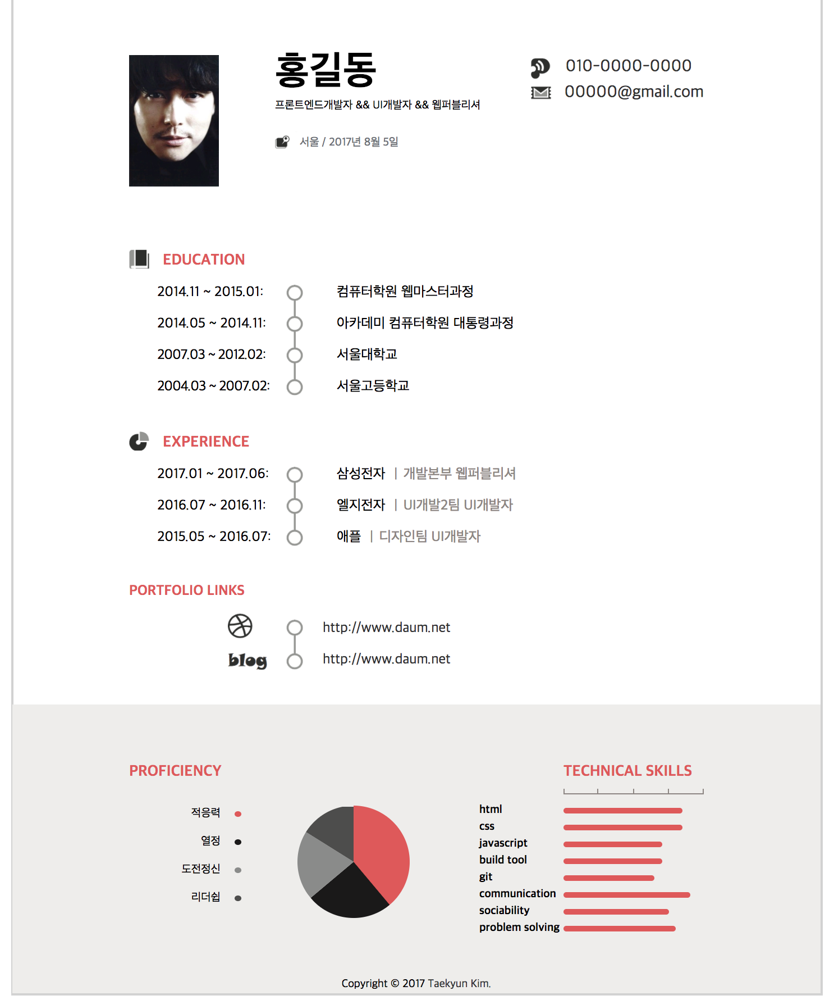

# 원페이지 HTML 템플릿 이력서

**순서**

git을 이용한만큼 git명령어를 좀 알아야한다. 어렵지 않다

깃이 설치되어있고, 노드가 설치되어있다는 가정하에 설명하도록 하겠다.

1. 터미널에 저장하고 싶은 경로로 이동

   잘모르겠다면…… cli명령어 포스팅으로 이동해서 공부해보자 

   [CLI명령어 포스팅으로 이동하기](https://tuhbm.github.io/2017/07/17/cli/)

2. git clone 하기 어렵지않다…그냥 복붙하는 것이라고 생각하면 된다.
    
    **git clone https://github.com/tuhbm/onePage_resume.git**
    
    이렇게 입력하면 끝!!!
    
3. 그리고 텍스트 수정 및 이력서 사진 변경
4. 세부 css변경은 minify 해 놓은 파일을 beautify기능이 있는 에디터 또는 밑에 사이트에서

    [css mifify 변경하기](http://www.cleancss.com/css-beautify/)
    
    변경하여 사용하기
    
 끝!!!
        

